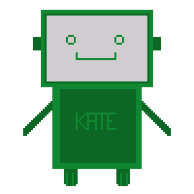

# b.I.A.s

## Project description
This project is a 2D RPG-style, dialogue-driven game with a pedagological undercurrent. The player assumes the role of a student in a school set in a fictional English village. There's an opening for a science teaching position which needs to be filled. The player is tasked to accompany an AI called K.A.T.E. whose purpose is to suggest the best possible candidate for the job. K.A.T.E needs to gather information from current teachers and the headmaster to make her suggestion. Will the player agree with her final decision? 

## Sources
CRAWFORD, K. 'Categorisation', in _Atlas of AI: power, politics, and the planetary costs of artificial intelligence_, Yale University Press, 2021.

* boyd, d. et Crawford, K. 2012. 'Critical questions for big data', in _Information, Communication & Society_, vol. 15, n°5, pp 662–679.

## Aim of the game
This project aims to raise awareness in a young audience about basic notions surrounding biases in Artificial Intelligence. One key aspect of the controversies that AI has raised in recent times involve biases. Kate Crawford has spent much of her career exploring such controversies, and has offered a fresh perspective on how such baises appear and manifest themselves in AI. Indeed, in one chapter of her book _Atlais of AI: power, politics, and the planetary costs of artificial intelligence_ she explains how the act of categorising objects or people when creating datasets from which AI can learn constitutes an "act of power" insofar as it is a reflection of mores, beliefs and practices in society – whether positive or negative. It is not the AI which spontaneously creates biases, it simply reflects the ones society holds. 

## Developement process
This game was originally conceived as a interactive fiction game to be developped in Inky. Eventually, we decided that wanted to include interactivity with an overwolrd environment, and chose to make the game in Kaboomjs instead.

While the hard coding was split evenly between us, the artwork (background, portraits, CVs, sprites) in the game was made from scratch by Tessa using a pixel art program. The dialogue was written by Sophie. The plot of the game and main narrative was a collaborative endeavour.

## Possible improvements
- As of right now the sound of the space bar plays in the corridor whenever you push the button, even if you are not close to any objects with which you can interact.

- We tried to have a camera follow the player so as to obtain a "scrolling" effect as they walked through the school corridor. Each attempt crashed the rest of the game. For this reason, the corridor area feels "static".

- Different functions throughout the code are declared multiple times in each scene, for purposes of clarity it would be preferable to declare them once at the beginning of the code but any attempt at doing so has resulted in either errors or the dialogues simply not working.

- At the start of development the addition of mini-games to access each teahcer's classroom was discussed. The mini-games would have helped the player to understand how K.A.T.E was built and how her problem solving skills could be applied to simple tasks. This idea proved to be too ambitious.

- Drawing is, unfortunately, not a skill that the creators posses. While the vast majority of the drawings are original works, they would benefit from an artist's touch. Assets could have been obtained online, but we wanted our own touch to be reflected in the game. 

- The addition of voiceover for the each dialogue would render the game more accessible. The possibility was discussed during developement but eventually abandoned due to time constraints.

## **Tools used**
- This project was conducted using the kaboomjs library and Visual Studio Code.

- This project was a collaborative effort produced in-person and using Visual Studio Code's Live Share extension. Commit rates are therefore not representative of the overall work distribution as they were made by whomever hosted the Live Share during collaboration sessions. 

## Development context
This project was developed as part of the course "Jeu vidéo 2D" (Spring 2022) taught by Prof. Isaac Pante (SLI, Lettres, UNIL)